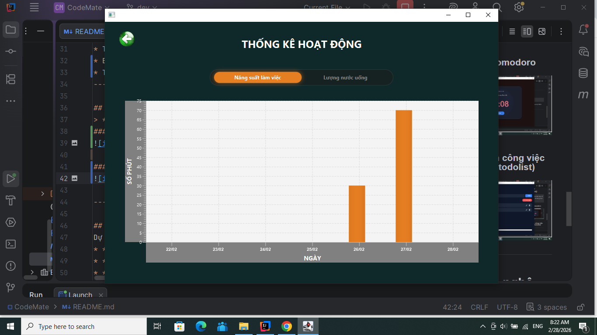
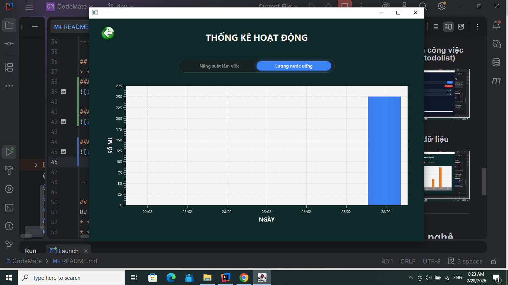
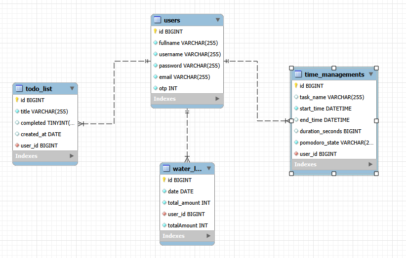

# 🤖CodeMate-Trợ lí công nghệ

[](#)
[](#)


## 📖 Giới thiệu (Introduction)
**CodeMate** là một ứng dụng được xây dựng để giúp bạn kiểm soát hoàn toàn một ngày làm việc của mình. Không chỉ dừng lại ở việc ghi chú các công việc cần làm (Todo List), ứng dụng còn tích hợp bộ đếm thời gian thực tế, cho phép bạn thống kê chính xác hôm nay tổng thời gian làm việc hiệu quả là bao nhiêu.

Dự án này được tạo ra nhằm giải quyết vấn đề mất tập trung và giúp người dùng đánh giá lại năng suất làm việc của bản thân một cách trực quan nhất.

---

## 📑 Mục lục (Table of Contents)
- [Tính năng nổi bật (List of Features)](#-tính-năng-nổi-bật-list-of-features)
- [Demo (Examples)](#-demo-examples)
- [Công nghệ sử dụng (Technologies Used)](#️-công-nghệ-sử-dụng-technologies-used)
- [Cài đặt (Install)](#-cài-đặt-install)

---

## ✨ Tính năng nổi bật (List of Features)
### 1. Hệ thống Xác thực (Authentication)
* **Đăng ký & Đăng nhập:** Bảo mật thông tin người dùng.
* **Quên mật khẩu (Forgot Password):** Hỗ trợ khôi phục tài khoản an toàn.
* *Giao diện được thiết kế trực quan bằng **Scene Builder**.*

### 2. Quản lý Thời gian & Todo (Core Features)
* Thêm, sửa, xóa task nhanh chóng.
* Bấm giờ (Pomodoro/Timer), đếm ngược thời gian hẹn giờ.
* Thống kê tổng số phút làm việc hiệu quả trong ngày và số lượng nước nạp vào cơ thể.
---

## 🎬 Demo (Examples)
> *Dưới đây là hình ảnh thực tế của ứng dụng khi đang hoạt động.*
### 1.Hẹn giờ pomodoro
 
 
### 2.Danh sách công việc trong ngày (todolist)


### 3.Thống kê dữ liệu



---

## 🛠️ Công nghệ sử dụng (Technologies Used)
Dự án được phát triển dựa trên mô hình MVC với các công nghệ chính:
* **Ngôn ngữ:** Java (JDK 17)
* **Giao diện (UI):** JavaFX & Scene Builder
* **Cơ sở dữ liệu:** SQLite/ MySQL (Lưu trữ thông tin user và lịch sử task,tổng thời gian)
* **Công cụ quản lý:** Maven / Gradle

---
## Sơ đồ EER Diagram

---

## 🚀 Cài đặt (Install)
Làm theo các bước sau để cài đặt và chạy ứng dụng trên máy của bạn:

1. **Clone repository này:**
   ```bash
   git clone git@github.com:TuyenMinh-dev/CodeMate.git
## 💖 Lời cảm ơn (Acknowledgments)

Dự án này được hoàn thiện nhờ sự hỗ trợ từ nhiều phía, cũng như các tài nguyên mã nguồn mở tuyệt vời.

* [JavaFX](https://openjfx.io/): Framework cốt lõi giúp xây dựng nền tảng ứng dụng.
* [Gluon Scene Builder](https://gluonhq.com/products/scene-builder/): Công cụ hỗ trợ thiết kế giao diện FXML trực quan và mạnh mẽ.
* [IntelliJ IDEA](https://www.jetbrains.com/idea/): Môi trường phát triển tích hợp (IDE) tuyệt vời, giúp tăng tốc quá trình viết code, quản lý cấu trúc MVC và gỡ lỗi hiệu quả.
* [MySQL Workbench](https://www.mysql.com/products/workbench/): Công cụ quản trị cơ sở dữ liệu trực quan, đóng vai trò quan trọng trong việc thiết kế, xây dựng các bảng dữ liệu và quản lý luồng thông tin của hệ thống (như tính năng đăng nhập, đăng ký và lưu trữ thống kê).